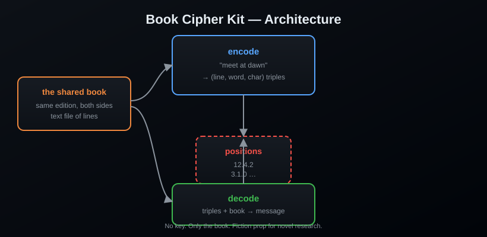

<div align="center">

# 📖 Book Cipher Kit


**The cipher that needs no key — only a shared book.**

[](https://www.python.org/)
[](LICENSE)
[](https://pypi.org/project/book-cipher-kit/)
[]()

> *"Anyone who has the book can read it. Anyone who doesn't, never will."*

</div>

---

## What is it?

A **book cipher** encodes each character of a message as a position inside the
words of a book: *(line, word, character)*. Without the same edition of the
same book, the positions are meaningless — and there is no key to steal, no
algorithm to break, no trace to find. It is the cipher of lovers, prisoners,
and people who trust each other with a bookstore.

## Features

- 🔡 Encode messages into `line.word.char` position triples
- 📚 Decode them back with the same book
- 🎲 Optional seed for reproducible (or plausibly deniable) output
- 📊 `stats` — tells you what your book can and cannot encode
- 🧾 Positions live in a plain text file — one triple per line, easy to hide
- 📦 Zero dependencies

## Install

```bash
pip install book-cipher-kit
```

From source:

```bash
git clone https://github.com/AnonymoDGH/book-cipher-kit
cd book-cipher-kit
pip install -e .
```

## Quickstart

```bash
# What can your book encode?
bookcipher stats --book novel.txt
# [*] Alphabet coverage: 98%
# [+] Found:   abcdefghijklmnopqrstuvwxyz
# [-] Missing: q

# Encode
bookcipher encode --book novel.txt --message "meet at dawn" --out coords.txt

# The courier carries only this:
cat coords.txt
# 12.4.2
# 3.1.0
# 87.12.5
# ...

# Decode on the other side
bookcipher decode --book novel.txt --input coords.txt
# meet at dawn
```

## CLI reference

| Command | What it does |
|---|---|
| `bookcipher encode --book <f> --message <m> [--out <f>] [--seed <n>]` | Message → positions |
| `bookcipher decode --book <f> --input <f>` | Positions → message |
| `bookcipher decode --book <f> --positions "1.0.2 2.3.0"` | Inline positions |
| `bookcipher stats --book <f>` | Alphabet coverage report |

## How it works



## Tests

```bash
pip install pytest
pytest
```

## License

[MIT](LICENSE) — a fiction research prop. Share the book, keep the story.
